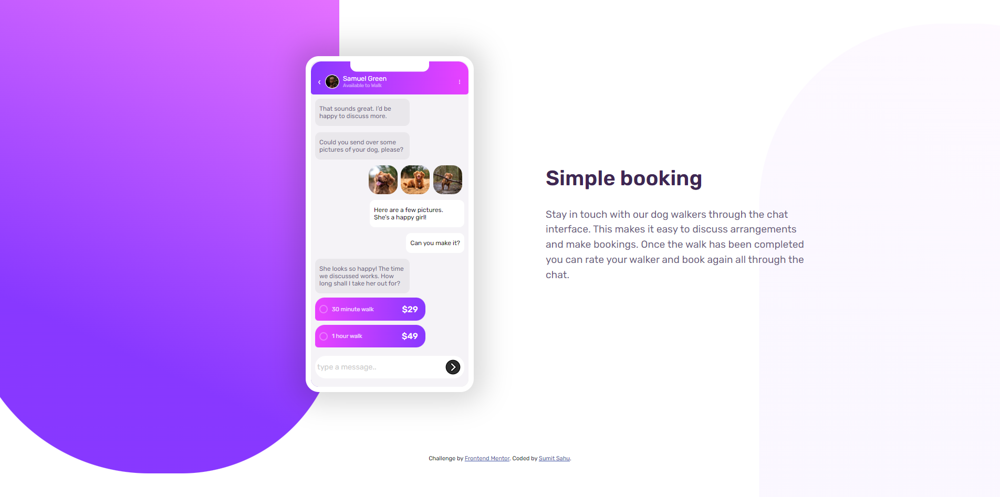
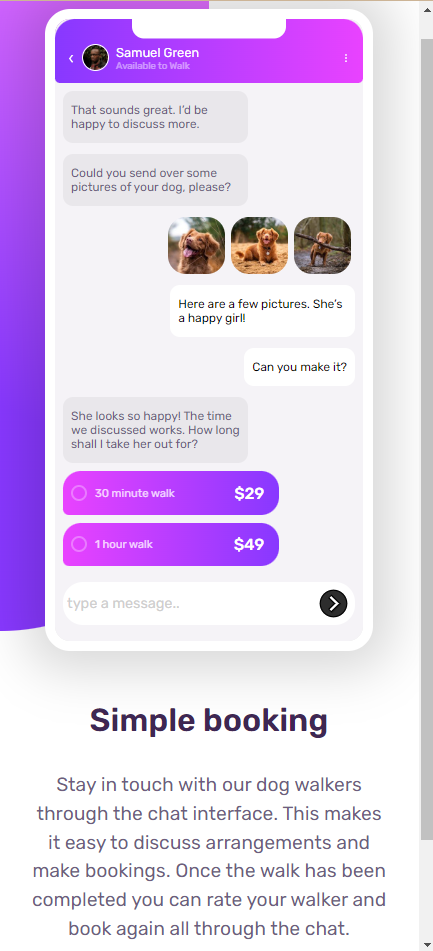

# Frontend Mentor - Chat app CSS illustration solution

This is a solution to the [Chat app CSS illustration challenge on Frontend Mentor](https://www.frontendmentor.io/challenges/chat-app-css-illustration-O5auMkFqY). Frontend Mentor challenges help you improve your coding skills by building realistic projects. 

## Table of contents

- [Overview](#overview)
  - [The challenge](#the-challenge)
  - [Screenshot](#screenshot)
  - [Links](#links)
- [My process](#my-process)
  - [Built with](#built-with)
  - [What I learned](#what-i-learned)
- [Author](#author)

## Overview

### The challenge

Users should be able to:

- View the optimal layout for the component depending on their device's screen size
- **Bonus**: See the chat interface animate on the initial load

### Screenshot

### Links

- Solution URL: [Here is my solution URL](https://github.com/sumitsah/chat-app-css-illustration)
- Live Site URL: [Here is live site URL](https://tranquil-starburst-a44527.netlify.app/)

## My process

### Built with

- Semantic HTML5 markup
- CSS custom properties
- Flexbox
- CSS Grid
- Mobile-first workflow

### What I learned

I want to test my css skills. So I hop on to this project. I utilised the CSS grid to create the text messages and alignement of text chat. This is not a perfect solution so I am open for any suggestions/feedback or push changes.  

## Author

- Website - [Sumit Sahu](https://www.linkedin.com/in/sumit-sahu-29064377/)
- Frontend Mentor - [@sumitsah](https://www.frontendmentor.io/profile/sumitsah)

